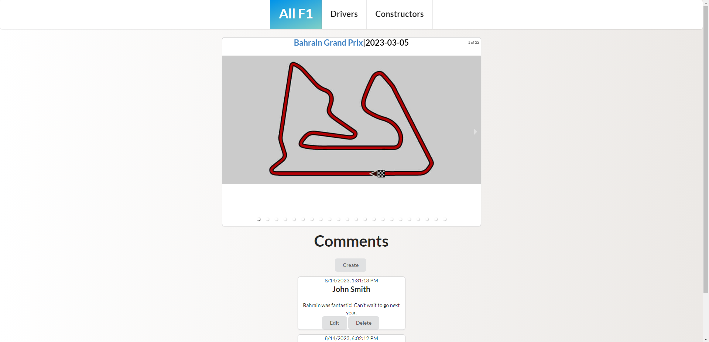

# All-F1
This MERN application is an F1 repository integrated with a third-party API. You can find up to date circuit, driver, and constructor information in a mobile friendly, responsive application.

## Technologies Used

- MongoDB Atlas
- Express
- React
- Node.js
- Vite
- CSS
- Postman
- Semantic-UI

## Installation Instructions

- Fork and clone to local environment
- Install necessary packages with

        npm i

- Create .env file and add these lines

        PORT=3000
        MONGODBURI="mongodb+srv://yourUsername:**REPLACEWITHYOURDATABASE**"

- Open two terminals, one for back-end, one for front-end
- Start back-end with

        npm run backend

- Start front-end with

        npm run frontend

## User Stories

- As a Formula 1 enjoyer, I want a site that shows the schedule for races.
- As a new Formula 1 fan, I want to see driver and constructor information.
- As a fan, I want a place to post comments and interact with others.

## Wireframes

**Home**

**Drivers Page**

**Constructors Page**

## Hurdles Overcome

Integrating a comment thread with each image in the carousel was the most challenging. But by leveraging React's useState hook, I was able to establish a seamless connection between individual comment threads and their respective carousel images.

## Next Steps

- User authentication/account creation
- Countdown to next upcoming race
- Recent news section
- Driver results section